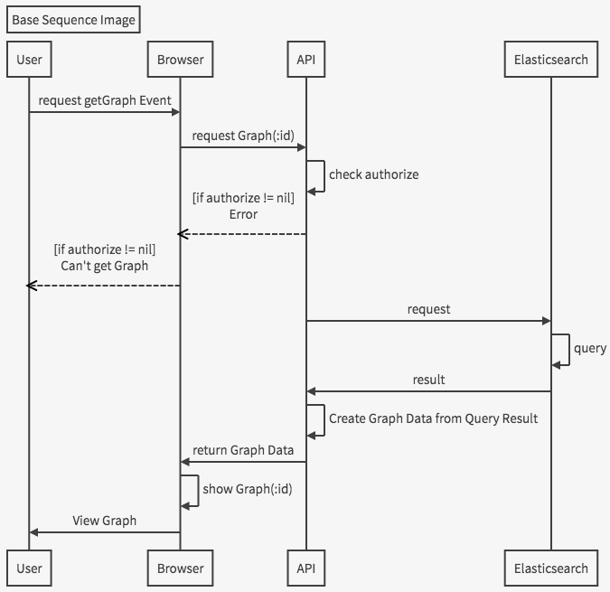

## What is it

Get report data API form Elasticsearch.
and Set report segmentation filters.

## Sequence

## URL List

| Path                    | Method | Paramaters                                                                                                                          | Response : Success                                                                    | Response : Error                                              | Comment                     |
|-------------------------|--------|-------------------------------------------------------------------------------------------------------------------------------------|---------------------------------------------------------------------------------------|---------------------------------------------------------------|-----------------------------|
| /v1/report/ | Post | {"auth":"authorize_key"} | {"status":http_status_code, "value":[{"name":id},{"name":id},..... ] } | {"status":http_status_code, "error":"error message" } | get report id list |
| /v1/report/detail/:all_or_any      | Post   | {   "auth":"authorize key",   "report":"report_id", }                                                                               | { "status":http_status_code, "value":{   "id":report_id,   ...value of your table } } | { "status":http_status_code, "error":"error message" }        | get report detail           |
| /v1/report/segment      | Post   | {   "auth":"authorize key",   "report":"report_id", }                                                                               | { "status":http_status_code, "value":[   {"name":"segment body"},   .... ] }          | { "status":http_status_code, "error":"error message" }        | get `segment` having report |
| /v1/report/segment/edit | Post   | {   "auth":"authorize_key",   "report":"report_id",   "segment": {     {"name1":"detail1"},     {"name2":"detail2"},     ....   } } | {"status":http_status_code,"value":[,{"name":"segment body"},....]}                  | { "status":http_status_code, "error":"error message" }        | edit `segment`              |

## Use Sample

not yet
